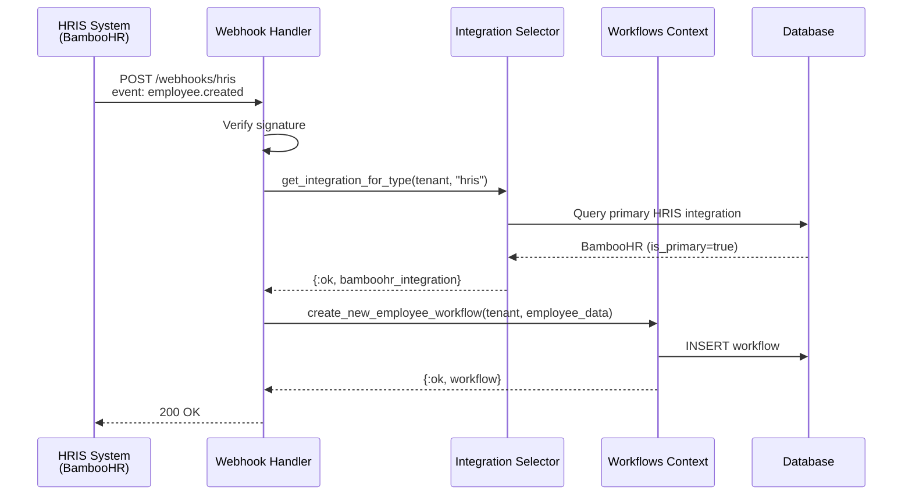

# Integration Selection & Priority

## Problem Statement

When a tenant configures multiple integrations of the same type (e.g., both BambooHR and Workday), the system needs to determine:
1. **Which integration to use** for automatic triggers (e.g., creating onboarding workflows)
2. **Priority order** when multiple active integrations exist
3. **Fallback behavior** if primary integration fails

---

## Solution: Integration Priority System

### Strategy 1: Primary Integration Flag (Recommended)

Each integration type can have ONE "primary" integration marked as the source of truth.

**Database Schema Addition**:
```sql
ALTER TABLE integrations ADD COLUMN is_primary BOOLEAN DEFAULT FALSE;

-- Ensure only one primary per type per tenant
CREATE UNIQUE INDEX idx_integrations_primary_per_type
ON integrations(tenant_id, integration_type)
WHERE is_primary = TRUE;
```

**Selection Logic**:
```elixir
def get_primary_integration(tenant, integration_type) do
  query = from i in Integration,
    where: i.integration_type == ^integration_type,
    where: i.is_primary == true,
    where: i.status == "active"

  Repo.one(query, prefix: Triplex.to_prefix(tenant))
end
```

**UI Behavior**:
- When user adds first HRIS integration → Automatically marked as primary
- When user adds second HRIS integration → Option to "Set as Primary" (requires confirmation)
- Settings page shows badge: "PRIMARY" next to active integration

---

### Strategy 2: Last Active Wins (Simpler)

Use the most recently activated integration of each type.

**Selection Logic**:
```elixir
def get_active_integration(tenant, integration_type) do
  query = from i in Integration,
    where: i.integration_type == ^integration_type,
    where: i.status == "active",
    order_by: [desc: i.updated_at],
    limit: 1

  Repo.one(query, prefix: Triplex.to_prefix(tenant))
end
```

**Pros**: Simple, no UI changes needed
**Cons**: Less control, can be confusing if integrations toggle on/off

---

### Strategy 3: Provider Precedence (Enterprise)

Define global precedence rules for providers.

**Precedence Order** (for HRIS):
```elixir
@hris_precedence ~w(workday bamboohr rippling gusto adp)
```

**Selection Logic**:
```elixir
def get_preferred_integration(tenant, integration_type) do
  precedence = get_precedence_order(integration_type)

  active_integrations = list_active_integrations(tenant, integration_type)

  # Sort by precedence order
  Enum.sort_by(active_integrations, fn integration ->
    Enum.find_index(precedence, &(&1 == integration.provider)) || 999
  end)
  |> List.first()
end
```

**Pros**: Enterprise-friendly, works across tenants
**Cons**: More complex, requires maintenance of precedence lists

---

## Recommended Approach: Hybrid

**Combine Strategy 1 + Strategy 3**:
1. **Check for `is_primary` flag** first
2. If no primary set, **use precedence order**
3. If still no match, **use most recent active**

```elixir
def get_integration_for_type(tenant, integration_type) do
  # Try primary first
  case get_primary_integration(tenant, integration_type) do
    %Integration{} = integration -> {:ok, integration}
    nil -> get_fallback_integration(tenant, integration_type)
  end
end

defp get_fallback_integration(tenant, integration_type) do
  active = list_active_integrations(tenant, integration_type)

  case active do
    [] -> {:error, :no_active_integration}
    [single] -> {:ok, single}
    multiple -> {:ok, select_by_precedence(multiple, integration_type)}
  end
end
```

---

## Automatic Workflow Creation Flow

### Scenario: New Employee Added to HRIS



### Code Implementation

```elixir
defmodule AssetronicsWeb.WebhookController do
  def hris_webhook(conn, params) do
    tenant = conn.assigns.tenant
    event = params["event"]

    with {:ok, integration} <- Integrations.get_integration_for_type(tenant, "hris"),
         {:ok, employee_data} <- parse_employee_data(params, integration.provider),
         {:ok, workflow} <- auto_create_workflow(tenant, event, employee_data) do

      json(conn, %{status: "success", workflow_id: workflow.id})
    else
      {:error, :no_active_integration} ->
        conn
        |> put_status(400)
        |> json(%{error: "No active HRIS integration configured"})

      error ->
        Logger.error("Webhook processing failed: #{inspect(error)}")
        conn |> put_status(500) |> json(%{error: "Processing failed"})
    end
  end

  defp auto_create_workflow(tenant, "employee.created", employee_data) do
    Workflows.create_new_employee_workflow(
      tenant,
      employee_data,
      triggered_by: "hris_sync",
      priority: "high"
    )
  end

  defp auto_create_workflow(tenant, "employee.terminated", employee_data) do
    Workflows.create_equipment_return_workflow(
      tenant,
      employee_data,
      triggered_by: "hris_sync",
      priority: "urgent"
    )
  end

  defp auto_create_workflow(_, _, _), do: {:ok, :ignored}
end
```

---

## UI: Integration Management

### Settings Page: Integrations View

```
┌─────────────────────────────────────────────────────────┐
│  Integrations > HRIS Systems                            │
├─────────────────────────────────────────────────────────┤
│                                                          │
│  ┌──────────────────────────────────────────────────┐   │
│  │  🟢 BambooHR                      [PRIMARY]      │   │
│  │  Status: Active                                  │   │
│  │  Last Sync: 2 hours ago                          │   │
│  │                                                   │   │
│  │  [Configure]  [Sync Now]  [Remove Primary]       │   │
│  └──────────────────────────────────────────────────┘   │
│                                                          │
│  ┌──────────────────────────────────────────────────┐   │
│  │  ⚪ Workday                                      │   │
│  │  Status: Active (Backup)                         │   │
│  │  Last Sync: 1 day ago                            │   │
│  │                                                   │   │
│  │  [Configure]  [Sync Now]  [Set as Primary]       │   │
│  └──────────────────────────────────────────────────┘   │
│                                                          │
│  [+ Add HRIS Integration]                               │
│                                                          │
│  ℹ️  The PRIMARY integration is used for automatic      │
│     workflow creation (onboarding, offboarding).        │
│     Backup integrations can be synced manually.         │
└─────────────────────────────────────────────────────────┘
```

### Setting Primary Integration Confirmation

```
┌─────────────────────────────────────────────┐
│  Switch Primary HRIS Integration?          │
├─────────────────────────────────────────────┤
│                                             │
│  This will set Workday as the primary      │
│  source for employee data and automatic    │
│  workflow creation.                         │
│                                             │
│  Current primary: BambooHR                  │
│  New primary: Workday                       │
│                                             │
│  ⚠️  Future workflows will be triggered    │
│     from Workday webhooks, not BambooHR.   │
│                                             │
│  [Cancel]              [Confirm Switch]    │
└─────────────────────────────────────────────┘
```

---

## Edge Cases & Handling

### Case 1: No Active Integration

**Scenario**: User tries to create workflow but no HRIS integrated

**Behavior**:
```elixir
case Integrations.get_integration_for_type(tenant, "hris") do
  {:ok, integration} -> create_workflow(...)
  {:error, :no_active_integration} ->
    {:error, "Please configure an HRIS integration first"}
end
```

**UI**: Show error message with link to `/settings/integrations`

---

### Case 2: Primary Integration Fails

**Scenario**: Primary BambooHR integration returns 500 error

**Behavior**:
```elixir
def sync_with_fallback(tenant, integration_type) do
  integrations = list_active_integrations(tenant, integration_type)

  Enum.reduce_while(integrations, {:error, :all_failed}, fn integration, _acc ->
    case attempt_sync(tenant, integration) do
      {:ok, result} -> {:halt, {:ok, result}}
      {:error, _} -> {:cont, {:error, :all_failed}}
    end
  end)
end
```

**Logging**:
```
[warn] Primary HRIS sync failed (BambooHR): API timeout
[info] Attempting fallback HRIS sync (Workday)
[info] Fallback sync successful
```

**Notification**: Email to admin about primary integration failure

---

### Case 3: Duplicate Webhooks

**Scenario**: Both BambooHR and Workday send webhooks for same employee

**Prevention**:
1. **Idempotency key**: Store `external_id` from HRIS in workflow metadata
2. **Duplicate check**:

```elixir
def create_workflow_if_not_exists(tenant, external_id, attrs) do
  case find_workflow_by_external_id(tenant, external_id) do
    nil -> create_workflow(tenant, attrs)
    existing -> {:ok, existing, :already_exists}
  end
end

defp find_workflow_by_external_id(tenant, external_id) do
  query = from w in Workflow,
    where: fragment("?->>'external_id' = ?", w.metadata, ^external_id)

  Repo.one(query, prefix: Triplex.to_prefix(tenant))
end
```

---

## Configuration Examples

### Example 1: Single HRIS (Most Common)

```elixir
# Tenant "acme" configuration
%{
  integrations: [
    %{
      type: "hris",
      provider: "bamboohr",
      status: "active",
      is_primary: true  # Automatically set for first integration
    }
  ]
}
```

**Behavior**: All HRIS operations use BambooHR

---

### Example 2: Multi-Region Setup

```elixir
# Tenant "globalcorp" configuration
%{
  integrations: [
    %{
      type: "hris",
      provider: "workday",
      status: "active",
      is_primary: true,
      metadata: %{regions: ["US", "EMEA"]}
    },
    %{
      type: "hris",
      provider: "bamboohr",
      status: "active",
      is_primary: false,
      metadata: %{regions: ["APAC"]}
    }
  ]
}
```

**Advanced Logic** (future):
```elixir
def get_integration_for_employee(tenant, employee) do
  region = employee.region

  integrations = list_active_integrations(tenant, "hris")

  # Filter by region in metadata
  Enum.find(integrations, fn i ->
    regions = get_in(i.metadata, ["regions"]) || []
    region in regions
  end) || get_primary_integration(tenant, "hris")
end
```

---

### Example 3: Gradual Migration

```elixir
# Migrating from BambooHR to Workday
%{
  integrations: [
    %{
      type: "hris",
      provider: "bamboohr",
      status: "active",
      is_primary: true,  # Still primary during migration
      metadata: %{migrating_to: "workday", cutover_date: "2025-12-31"}
    },
    %{
      type: "hris",
      provider: "workday",
      status: "active",
      is_primary: false,  # Will become primary on cutover
      metadata: %{sync_mode: "shadow"}  # Sync but don't trigger workflows
    }
  ]
}
```

**Cutover Process**:
1. Admin clicks "Switch to Workday" on cutover date
2. System sets `workday.is_primary = true`, `bamboohr.is_primary = false`
3. Future webhooks route to Workday
4. BambooHR kept active for historical data access

---

## Testing Integration Selection

### Unit Test

```elixir
defmodule Assetronics.IntegrationsTest do
  use Assetronics.DataCase

  describe "get_integration_for_type/2" do
    test "returns primary integration when multiple exist" do
      tenant = insert(:tenant)

      # Create non-primary
      insert(:integration,
        tenant: tenant,
        integration_type: "hris",
        provider: "bamboohr",
        status: "active",
        is_primary: false
      )

      # Create primary
      workday = insert(:integration,
        tenant: tenant,
        integration_type: "hris",
        provider: "workday",
        status: "active",
        is_primary: true
      )

      assert {:ok, integration} = Integrations.get_integration_for_type(tenant.slug, "hris")
      assert integration.id == workday.id
      assert integration.provider == "workday"
    end

    test "returns error when no active integration" do
      tenant = insert(:tenant)

      assert {:error, :no_active_integration} =
        Integrations.get_integration_for_type(tenant.slug, "hris")
    end

    test "returns single active integration even if not marked primary" do
      tenant = insert(:tenant)

      bamboo = insert(:integration,
        tenant: tenant,
        integration_type: "hris",
        provider: "bamboohr",
        status: "active",
        is_primary: false  # Not explicitly primary
      )

      assert {:ok, integration} = Integrations.get_integration_for_type(tenant.slug, "hris")
      assert integration.id == bamboo.id
    end
  end
end
```

---

## Summary

### Decision Matrix

| Scenario | Selection Method | Example |
|----------|-----------------|---------|
| **Single active integration** | Use that one | Tenant has only BambooHR → Use it |
| **Multiple, one marked primary** | Use primary | BambooHR (primary) + Workday → Use BambooHR |
| **Multiple, none marked primary** | Use precedence order | Workday + BambooHR → Use Workday (higher precedence) |
| **Multiple with precedence tie** | Use most recently activated | Both updated today → Use last modified |
| **No active integrations** | Return error | No HRIS configured → Error message |

### Implementation Priority

**Phase 1 (MVP)**: Simple selection
- ✅ Use first active integration of type
- ✅ Return error if none active

**Phase 2**: Primary flag ✅ **COMPLETED (Backend)**
- ✅ Add `is_primary` column (migration created and run)
- ✅ Backend functions: `get_integration_for_type/2`, `set_as_primary/2`, `unset_primary/2`
- ✅ Hybrid selection logic (primary → single → most recent)
- ⬜ UI to set/change primary (pending frontend implementation)
- ⬜ Automatic primary assignment for first integration (pending)

**Phase 3**: Advanced
- ⬜ Precedence-based fallback
- ⬜ Region-based routing
- ⬜ Failover logic with retry

---

## Implementation Status

### ✅ Completed (2025-11-30)

**Backend Implementation:**
- Created database migration: `20251130000000_add_is_primary_to_integrations.exs`
- Added `is_primary` field to Integration schema
- Implemented core selection functions in `lib/assetronics/integrations.ex`:
  - `get_integration_for_type/2` - Main function to retrieve the correct integration
  - `get_primary_integration/2` - Query for primary integration of a type
  - `list_active_by_type/2` - List all active integrations of a type
  - `set_as_primary/2` - Set integration as primary (with transaction)
  - `unset_primary/2` - Remove primary flag from integration
  - `select_most_recent/1` - Helper to choose most recently updated
- Database constraints: Unique partial index ensures only one primary per integration type per tenant
- Migration applied to tenant schemas

**Selection Logic:**
1. First checks for primary integration (`is_primary = true`)
2. Falls back to single active integration if no primary
3. Falls back to most recently updated if multiple active
4. Returns error if no active integrations

### ⬜ Pending

**Frontend Implementation:**
- Integration settings UI to display primary badge
- "Set as Primary" button with confirmation dialog
- Visual indicator showing which integration is primary
- Ability to switch primary integration

**Automatic Primary Assignment:**
- Logic to automatically mark first integration as primary when created
- Hook in `create_integration/2` function to set `is_primary: true` if no others exist

**API Endpoints:**
- `POST /api/v1/integrations/:id/set-primary` - Set integration as primary
- `POST /api/v1/integrations/:id/unset-primary` - Remove primary flag

### 🔧 Next Steps

1. **Implement automatic primary assignment**:
   - Modify `create_integration/2` in integrations.ex
   - Check if any integrations of same type exist
   - If none, set `is_primary: true` automatically

2. **Add API endpoints** in `workflow_controller.ex`:
   ```elixir
   def set_primary(conn, %{"id" => id}) do
     tenant = conn.assigns[:tenant]
     integration = Integrations.get_integration!(tenant, id)

     with {:ok, updated} <- Integrations.set_as_primary(tenant, integration) do
       render(conn, :show, integration: updated)
     end
   end
   ```

3. **Build frontend UI components**:
   - Update IntegrationCard.vue to show primary badge
   - Add "Set as Primary" button with confirmation modal
   - Update IntegrationsView.vue to handle primary switching

---

**Last Updated**: 2025-11-30
**Migration File**: `backend/priv/repo/tenant_migrations/20251130000000_add_is_primary_to_integrations.exs`
**Implementation**: Backend Complete | Frontend Pending
