# Workflows System Architecture

This document provides detailed technical architecture diagrams for the Assetronics workflow system.

---

## System Component Diagram

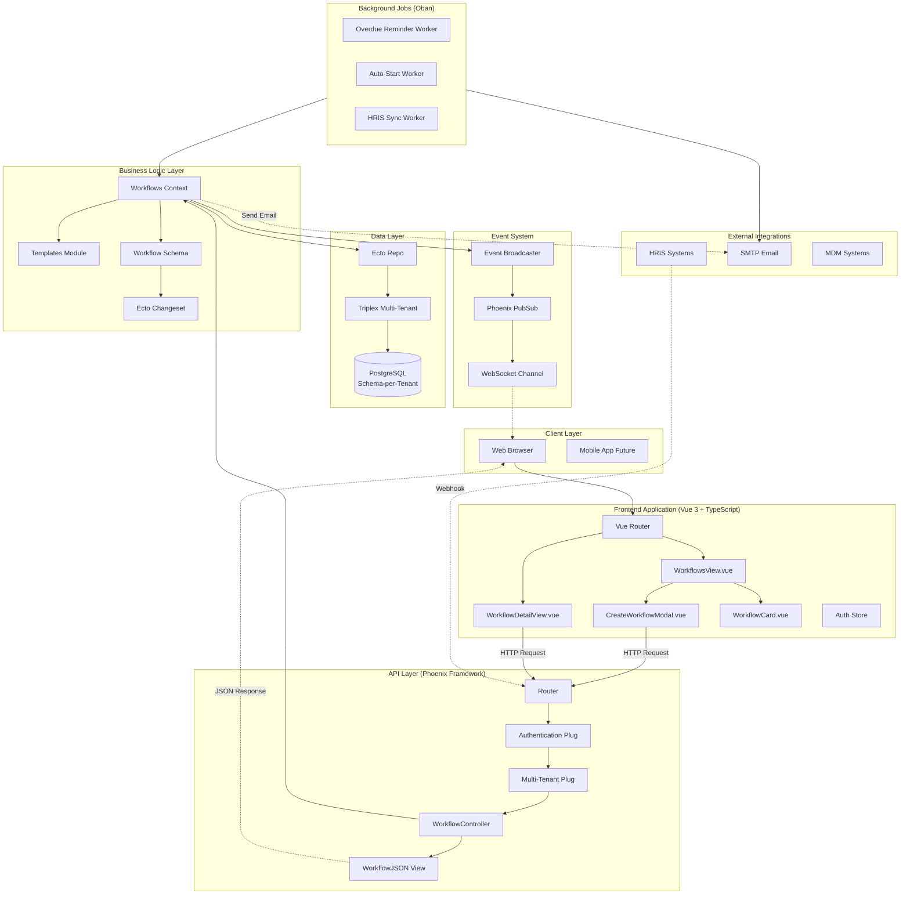

---

## Data Flow: Creating a Workflow from Template

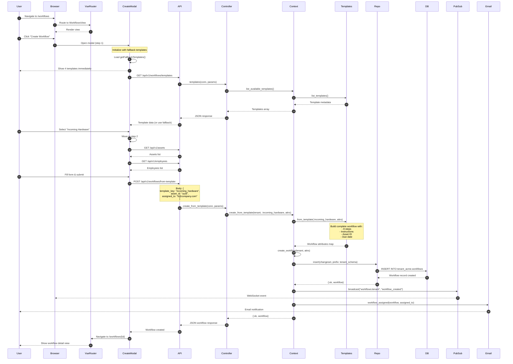

---

## Workflow State Machine

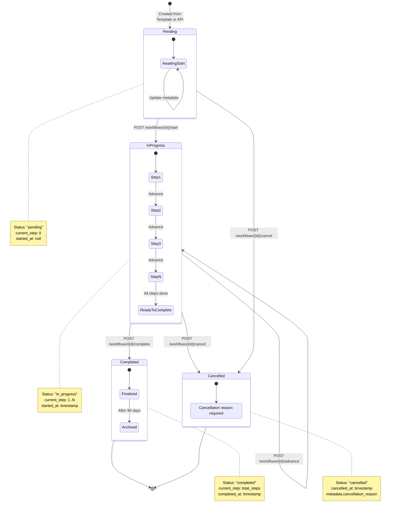

---

## Template Processing Flow

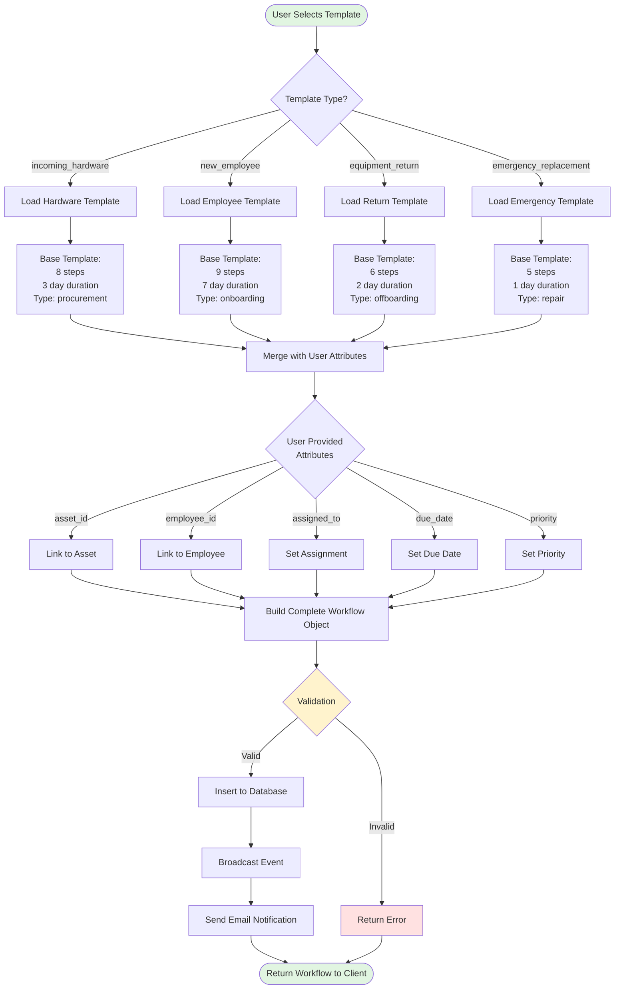

---

## Multi-Tenant Data Isolation

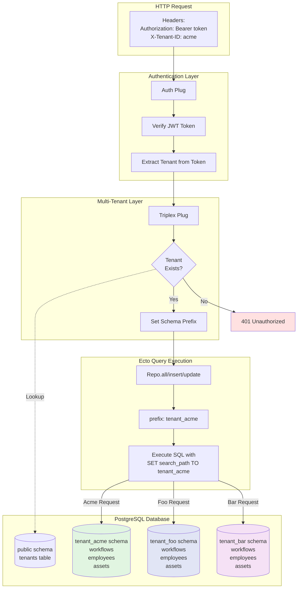

---

## Integration Triggers: Auto-Creating Workflows

```mermaid
graph LR
    subgraph HRIS["HRIS System (BambooHR)"]
        NewHire[New Employee<br/>Added]
        Terminated[Employee<br/>Terminated]
    end

    subgraph Webhook["Webhook Handler"]
        Receiver[POST /api/v1/webhooks/hris]
        Verify[Verify Signature]
        Parse[Parse Payload]
    end

    subgraph Logic["Business Logic"]
        CheckEvent{Event Type?}
        CreateOnboard[Create Onboarding<br/>Workflow]
        CreateOffboard[Create Offboarding<br/>Workflow]
    end

    subgraph Workflow["Workflow System"]
        OnboardTemplate[New Employee Template<br/>9 steps, 7 days]
        OffboardTemplate[Equipment Return Template<br/>6 steps, 2 days]
        InsertDB[(Insert Workflow)]
    end

    subgraph Notify["Notifications"]
        EmailIT[Email IT Team]
        SlackMsg[Slack Message]
    end

    NewHire -->|Webhook POST| Receiver
    Terminated -->|Webhook POST| Receiver

    Receiver --> Verify
    Verify --> Parse
    Parse --> CheckEvent

    CheckEvent -->|employee.created| CreateOnboard
    CheckEvent -->|employee.terminated| CreateOffboard

    CreateOnboard --> OnboardTemplate
    CreateOffboard --> OffboardTemplate

    OnboardTemplate --> InsertDB
    OffboardTemplate --> InsertDB

    InsertDB --> EmailIT
    InsertDB --> SlackMsg

    style NewHire fill:#e1f5e1
    style Terminated fill:#ffe1e1
```

---

## Background Job Architecture

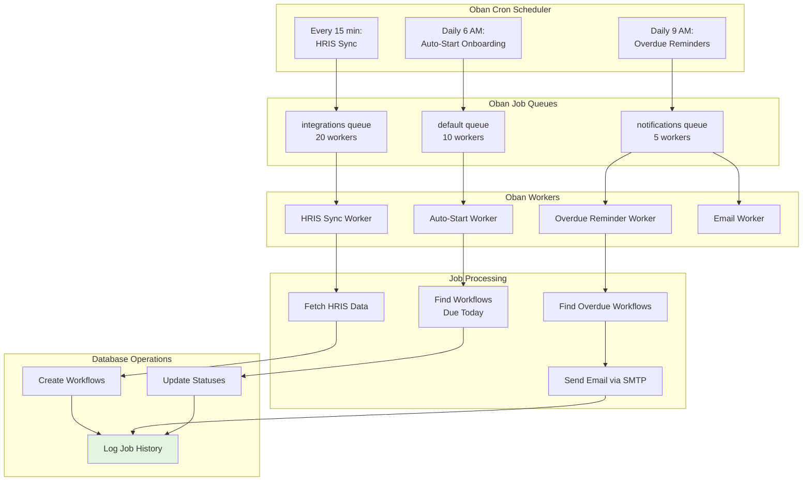

---

## Real-Time Event Broadcasting

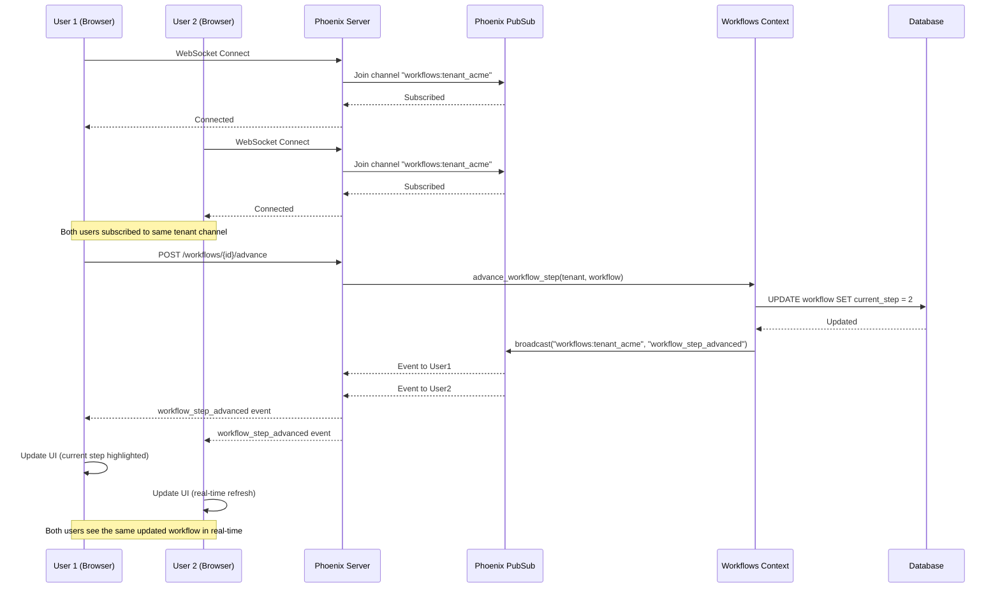

---

## Template Step Structure

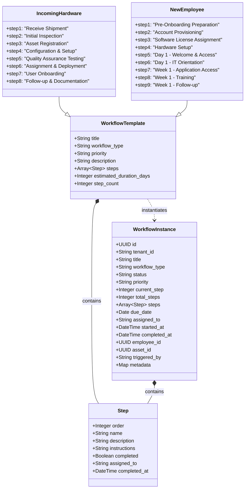

---

## Security & Authorization Flow

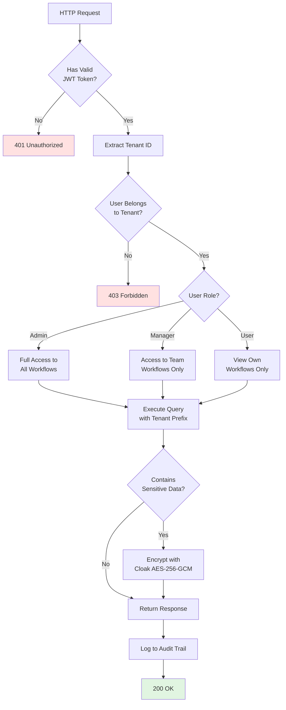

---

## Performance Optimization Strategy

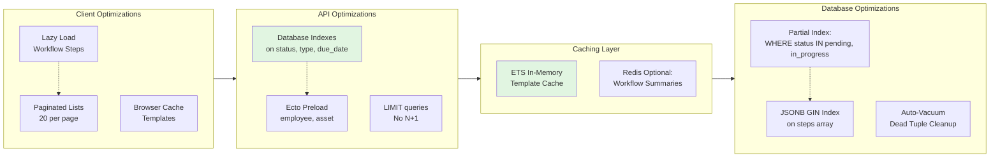

---

## Monitoring & Observability

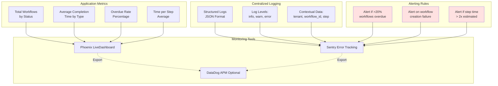

---

## Deployment Architecture

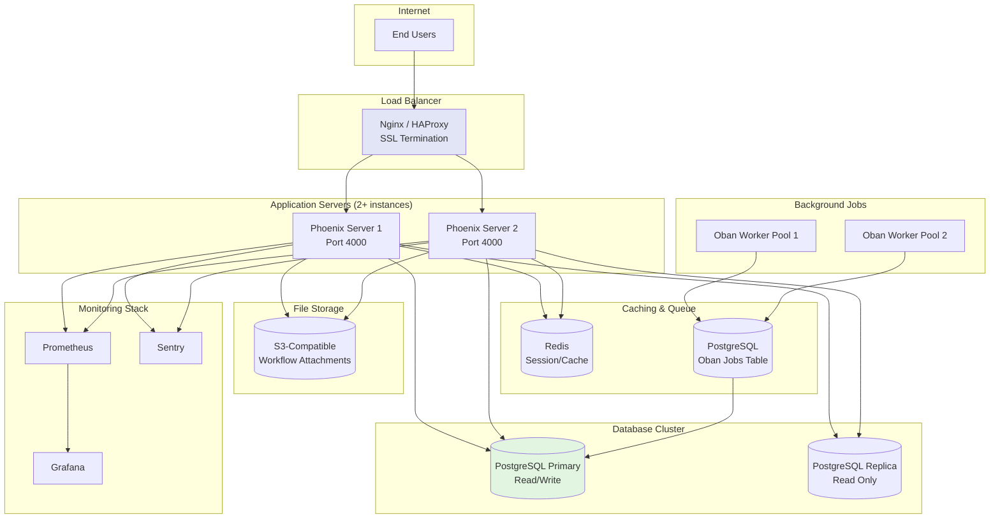

---

**Last Updated**: 2025-11-30
**Version**: 1.0.0
