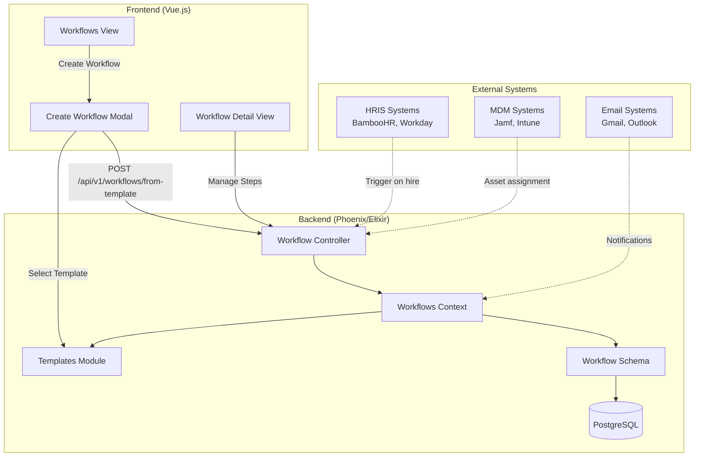
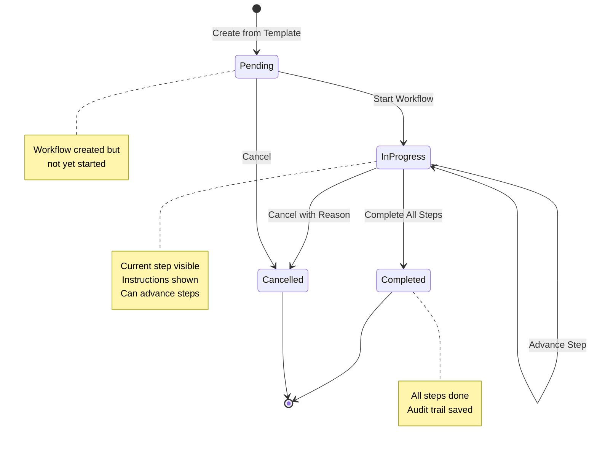
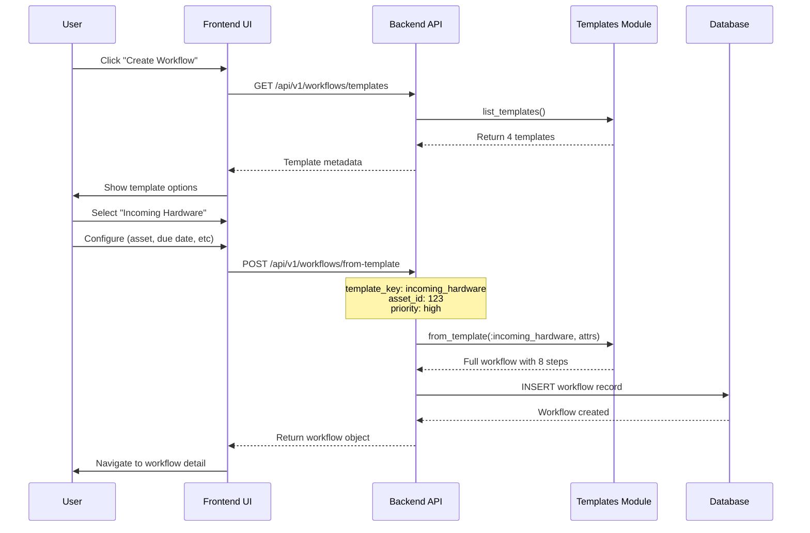

# Workflows & Templates Guide

## Table of Contents
1. [Overview](#overview)
2. [System Architecture](#system-architecture)
3. [Workflow Templates](#workflow-templates)
4. [Creating Workflows](#creating-workflows)
5. [Managing Workflows](#managing-workflows)
6. [API Reference](#api-reference)
7. [Best Practices](#best-practices)

---

## Overview

The Assetronics workflow system provides automated, step-by-step processes for common IT asset management tasks. Workflows ensure consistency, reduce errors, and provide full audit trails for critical operations like employee onboarding, hardware deployment, and equipment returns.

### Key Concepts

- **Workflow**: A multi-step process with defined tasks, assignments, and due dates
- **Template**: A pre-configured workflow blueprint with standardized steps
- **Step**: An individual task within a workflow with instructions and completion tracking
- **Status**: Current state of the workflow (pending, in_progress, completed, cancelled)
- **Priority**: Urgency level (low, normal, high, urgent)

---

## System Architecture

### High-Level Architecture Diagram



### Workflow Lifecycle



### Template to Workflow Process



---

## Workflow Templates

Assetronics includes 4 pre-built workflow templates based on IT industry best practices:

### 1. Incoming Hardware Setup

**Use Case**: Receiving, configuring, and deploying new hardware equipment

**Duration**: ~3 days
**Steps**: 8
**Type**: Procurement

**Workflow Steps**:
1. **Receive Shipment** - Verify delivery, inspect packaging, check serial numbers
2. **Initial Inspection** - Quality check, verify accessories, document condition
3. **Asset Registration** - Create asset record, upload photos, assign asset tag
4. **Configuration & Setup** - Install OS, security patches, MDM enrollment, encryption
5. **Quality Assurance Testing** - Test all components, verify network connectivity
6. **Assignment & Deployment** - Assign to employee, prepare documentation
7. **User Onboarding** - Hardware handoff, training, policy review
8. **Follow-up & Documentation** - Obtain signed forms, close workflow

**Typical Use Cases**:
- New laptop orders from Dell/CDW
- Desktop workstation setup
- Mobile device provisioning
- Peripheral equipment deployment

---

### 2. New Employee IT Onboarding

**Use Case**: Complete IT setup for new staff members from pre-start through first week

**Duration**: ~7 days (Day -5 to Day +7)
**Steps**: 9
**Type**: Onboarding

**Workflow Steps**:
1. **Pre-Onboarding Preparation (Day -5)** - Review requirements, order equipment
2. **Account Provisioning (Day -3)** - Create email, SSO, Slack, VPN accounts
3. **Software License Assignment (Day -2)** - Allocate M365, specialized software licenses
4. **Hardware Setup (Day -1)** - Configure device, install software, stage equipment
5. **Day 1 - Welcome & Access** - Provide hardware, share credentials, setup MFA
6. **Day 1 - IT Orientation** - System tour, security training, policy review
7. **Week 1 - Application Access Setup** - Grant business app access, shared drives
8. **Week 1 - Training & Documentation** - Knowledge base access, video tutorials
9. **Week 1 - Follow-up & Validation** - Verify all systems working, collect feedback

**Triggered By**:
- HRIS integration (BambooHR, Workday) when new employee added
- Manual creation from HR notification
- Scheduled for start date

---

### 3. Equipment Return & Offboarding

**Use Case**: Secure process for recovering equipment when employee departs

**Duration**: ~2 days
**Steps**: 6
**Type**: Offboarding

**Workflow Steps**:
1. **Schedule Equipment Return** - Coordinate logistics, provide shipping label
2. **Data Backup (If Needed)** - Backup critical data per retention policy
3. **Receive & Inspect Equipment** - Accept items, assess condition, document damage
4. **Revoke Access & Remove MDM** - Remove from Jamf/Intune, disable accounts
5. **Wipe & Reconfigure** - Factory reset, reinstall OS, prepare for redeployment
6. **Update Records & Close** - Update asset assignment, file documentation

**Triggered By**:
- HRIS integration when employee terminated
- Manual creation when equipment returned early
- Scheduled for last day of employment

---

### 4. Emergency Hardware Replacement

**Use Case**: Fast-track replacement for failed or damaged equipment

**Duration**: ~1 day
**Steps**: 5
**Type**: Repair

**Workflow Steps**:
1. **Assess Situation** - Document failure, assess business impact, check warranty
2. **Approve Replacement** - Get manager approval, check budget, notify procurement
3. **Provision Replacement Device** - Quick config, essential apps, data transfer
4. **Deploy to User** - Urgent delivery, setup assistance, collect failed device
5. **Handle Failed Device** - Data recovery, warranty claim, repair or disposal

**Triggered By**:
- IT support ticket for device failure
- Employee report of damaged equipment
- Manual creation for urgent need

**Priority**: Usually set to "urgent"

---

## Creating Workflows

### Via UI (Recommended)

#### Step 1: Navigate to Workflows
1. Log in to Assetronics
2. Click **"Workflows"** in the left sidebar
3. Click **"Create Workflow"** button (top right)

#### Step 2: Select Template
Choose one of the 4 templates based on your need:
- Incoming Hardware Setup
- New Employee IT Onboarding
- Equipment Return & Offboarding
- Emergency Hardware Replacement

Click the template card to select it, then click **"Next"**

#### Step 3: Configure Workflow
Fill in the required fields based on template type:

**For Procurement/Repair workflows**:
- **Asset**: Select the hardware asset from dropdown
- **Assigned To**: IT team member email (e.g., `it@company.com`)
- **Due Date**: Target completion date
- **Priority**: low, normal, high, or urgent

**For Onboarding workflows**:
- **Employee**: Select the new hire from dropdown
- **Asset** (optional): Pre-assign hardware if available
- **Assigned To**: IT team member email
- **Due Date**: Employee start date + 7 days
- **Priority**: Usually "high" for new hires

Click **"Create Workflow"** to instantiate the workflow.

---

### Via API

#### Endpoint: Create from Template
```http
POST /api/v1/workflows/from-template
Content-Type: application/json
Authorization: Bearer {token}
X-Tenant-ID: {tenant_id}

{
  "template_key": "incoming_hardware",
  "asset_id": "uuid-of-asset",
  "employee_id": "uuid-of-employee",  // optional
  "assigned_to": "it@company.com",
  "due_date": "2025-12-15",
  "priority": "high"
}
```

**Template Keys**:
- `incoming_hardware`
- `new_employee`
- `equipment_return`
- `emergency_replacement`

**Response**:
```json
{
  "data": {
    "id": "workflow-uuid",
    "workflow_type": "procurement",
    "title": "Incoming Hardware: MacBook Pro 14\"",
    "status": "pending",
    "priority": "high",
    "current_step": 0,
    "total_steps": 8,
    "steps": [
      {
        "order": 1,
        "name": "Receive Shipment",
        "description": "Verify shipment contents match purchase order",
        "completed": false,
        "instructions": "- Verify tracking number...\n- Inspect packaging..."
      }
      // ... 7 more steps
    ],
    "due_date": "2025-12-15",
    "assigned_to": "it@company.com",
    "asset": {
      "id": "asset-uuid",
      "name": "MacBook Pro 14\"",
      "asset_tag": "MBP-001"
    }
  }
}
```

---

## Managing Workflows

### Workflow Operations

#### 1. Start Workflow
Transition from "pending" to "in_progress"

**UI**: Click **"Start Workflow"** button
**API**:
```http
POST /api/v1/workflows/{id}/start
```

Sets `status = "in_progress"` and `started_at = now()`

---

#### 2. Advance Step
Mark current step as complete and move to next step

**UI**: Click **"Complete Current Step"** button
**API**:
```http
POST /api/v1/workflows/{id}/advance
```

Updates:
- Current step marked as `completed: true`
- `current_step` incremented by 1
- Broadcasts event for real-time updates

---

#### 3. Complete Workflow
Finalize workflow when all steps done

**UI**: Click **"Complete Workflow"** button (appears when on last step)
**API**:
```http
POST /api/v1/workflows/{id}/complete
```

Validates all steps are completed, then sets:
- `status = "completed"`
- `completed_at = now()`

---

#### 4. Cancel Workflow
Cancel with reason tracking

**UI**: Click **"Cancel"** → Enter reason → Confirm
**API**:
```http
POST /api/v1/workflows/{id}/cancel
Content-Type: application/json

{
  "reason": "Employee declined offer before start date"
}
```

Sets:
- `status = "cancelled"`
- `cancelled_at = now()`
- `metadata.cancellation_reason = reason`

---

### Viewing Workflows

#### List View (`/workflows`)
- **Filter by Type**: onboarding, offboarding, procurement, repair, maintenance
- **Filter by Status**: pending, in_progress, completed, cancelled
- **Filter by Priority**: low, normal, high, urgent

Each workflow card shows:
- Title and description
- Status and priority badges
- Progress bar (X / Y steps)
- Due date (with overdue warnings)
- Associated employee/asset
- Quick action buttons (Start, Complete)

---

#### Detail View (`/workflows/{id}`)

**Header Section**:
- Workflow title
- Status, priority, type badges
- Breadcrumb navigation

**Info Cards**:
- Progress: Current step / Total steps with visual bar
- Due Date: Formatted date with overdue highlighting
- Assigned To: IT team member email

**Related Information**:
- Employee details (name, email, avatar)
- Asset details (name, asset tag)

**Workflow Steps**:
- Numbered steps with completion status
- Green checkmark for completed steps
- Blue highlight for current step
- Expandable instructions (click "Show Instructions")
- Pre-formatted checklists and guidance

**Actions**:
- **Start Workflow** (pending workflows)
- **Complete Current Step** (in progress, not on last step)
- **Complete Workflow** (in progress, on last step)
- **Cancel** (in progress workflows)

---

## API Reference

### Templates

#### List Available Templates
```http
GET /api/v1/workflows/templates
```

**Response**:
```json
{
  "data": [
    {
      "key": "incoming_hardware",
      "name": "Incoming Hardware Setup",
      "type": "procurement",
      "description": "Complete process for receiving, configuring, and deploying new hardware",
      "estimated_duration_days": 3,
      "step_count": 8
    }
    // ... 3 more templates
  ]
}
```

---

### Workflows

#### List Workflows
```http
GET /api/v1/workflows?workflow_type=onboarding&status=in_progress&priority=high
```

**Query Parameters**:
- `workflow_type`: onboarding, offboarding, procurement, repair, maintenance, transfer, audit
- `status`: pending, in_progress, completed, cancelled, failed
- `priority`: low, normal, high, urgent
- `employee_id`: Filter by employee UUID
- `asset_id`: Filter by asset UUID

---

#### Get Workflow
```http
GET /api/v1/workflows/{id}
```

Returns full workflow with all steps, employee data, asset data.

---

#### Create from Template
```http
POST /api/v1/workflows/from-template
Content-Type: application/json

{
  "template_key": "incoming_hardware",
  "asset_id": "uuid",
  "assigned_to": "it@company.com",
  "due_date": "2025-12-15",
  "priority": "high"
}
```

---

#### Update Workflow
```http
PATCH /api/v1/workflows/{id}
Content-Type: application/json

{
  "workflow": {
    "assigned_to": "newperson@company.com",
    "priority": "urgent",
    "due_date": "2025-12-10"
  }
}
```

---

#### Start Workflow
```http
POST /api/v1/workflows/{id}/start
```

---

#### Advance Step
```http
POST /api/v1/workflows/{id}/advance
```

---

#### Complete Workflow
```http
POST /api/v1/workflows/{id}/complete
```

---

#### Cancel Workflow
```http
POST /api/v1/workflows/{id}/cancel
Content-Type: application/json

{
  "reason": "No longer needed"
}
```

---

#### Delete Workflow
```http
DELETE /api/v1/workflows/{id}
```

---

#### Get Overdue Workflows
```http
GET /api/v1/workflows/overdue
```

Returns all pending or in_progress workflows past their due date.

---

## Best Practices

### 1. Workflow Creation

✅ **DO**:
- Use templates whenever possible for consistency
- Set realistic due dates based on template estimates
- Assign to specific team members, not generic emails
- Link workflows to assets and employees for context
- Set appropriate priority levels

❌ **DON'T**:
- Create custom workflows unless absolutely necessary
- Skip steps to rush through processes
- Leave workflows in "pending" indefinitely
- Forget to update status when work is done

---

### 2. Step Management

✅ **DO**:
- Read instructions before marking steps complete
- Document any deviations in notes/metadata
- Advance steps in order (don't skip ahead)
- Use the expandable instructions as checklists
- Update due dates if delays occur

❌ **DON'T**:
- Mark steps complete without doing the work
- Skip critical steps like security configuration
- Ignore overdue warnings
- Complete workflows with failed steps

---

### 3. Integration Automation

**Automatic Workflow Creation**:

1. **HRIS Integration** → New Employee Onboarding
   - When: New hire added to BambooHR/Workday
   - Triggered: Day -5 before start date
   - Auto-assigned: Based on department/location

2. **HRIS Integration** → Equipment Return
   - When: Employee terminated in HRIS
   - Triggered: On termination date
   - Auto-assigned: IT asset manager

3. **Procurement Integration** → Incoming Hardware
   - When: Order confirmed in Dell/CDW
   - Triggered: On shipment tracking available
   - Auto-assigned: IT receiving team

4. **Support Ticket** → Emergency Replacement
   - When: Critical device failure ticket created
   - Triggered: Manual by support agent
   - Priority: Always set to "urgent"

---

### 4. Notifications & Reminders

**Email Notifications** (configured in `lib/assetronics/emails/workflow_email.ex`):

- **Workflow Assigned**: Sent when workflow assigned to team member
- **Workflow Overdue**: Daily digest of overdue workflows
- **Step Reminder**: Sent 1 day before due date
- **Workflow Completed**: Confirmation email with audit trail

**Customize notification preferences** in `/settings/notifications`

---

### 5. Audit & Compliance

**Every workflow tracks**:
- Who created it (`triggered_by`, `integration_id`)
- When each step was completed (`completed_at` in steps array)
- Who performed the work (`assigned_to`)
- Start and end timestamps (`started_at`, `completed_at`)
- Cancellation reasons (if applicable)

**Use for compliance**:
- SOC2 audit trails
- ISO27001 evidence collection
- IT asset lifecycle documentation
- Employee onboarding/offboarding proof

**Export workflow history**:
```http
GET /api/v1/workflows?workflow_type=onboarding&status=completed
```

Filter by date range, employee, or asset for audit reports.

---

## Architecture Details

### Database Schema

**Table**: `workflows` (multi-tenant, each tenant has own schema)

```sql
CREATE TABLE workflows (
  id UUID PRIMARY KEY,
  tenant_id VARCHAR NOT NULL,

  -- Workflow metadata
  workflow_type VARCHAR NOT NULL,  -- onboarding, offboarding, procurement, repair, etc.
  title VARCHAR NOT NULL,
  description TEXT,

  -- Status tracking
  status VARCHAR DEFAULT 'pending',  -- pending, in_progress, completed, cancelled, failed
  priority VARCHAR DEFAULT 'normal',  -- low, normal, high, urgent

  -- Step management
  steps JSONB,  -- Array of step objects with instructions
  current_step INTEGER DEFAULT 0,

  -- Assignment
  assigned_to VARCHAR,
  approver VARCHAR,
  approved_at TIMESTAMP,
  approval_notes TEXT,

  -- Temporal tracking
  due_date DATE,
  started_at TIMESTAMP,
  completed_at TIMESTAMP,
  cancelled_at TIMESTAMP,

  -- Relationships
  employee_id UUID REFERENCES employees(id),
  asset_id UUID REFERENCES assets(id),
  integration_id UUID REFERENCES integrations(id),

  -- Metadata
  triggered_by VARCHAR,  -- manual, hris_sync, scheduled, api, webhook
  metadata JSONB,
  notes TEXT,

  -- Audit
  inserted_at TIMESTAMP DEFAULT NOW(),
  updated_at TIMESTAMP DEFAULT NOW()
);

-- Indexes for performance
CREATE INDEX idx_workflows_type ON workflows(workflow_type);
CREATE INDEX idx_workflows_status ON workflows(status);
CREATE INDEX idx_workflows_employee ON workflows(employee_id);
CREATE INDEX idx_workflows_asset ON workflows(asset_id);
CREATE INDEX idx_workflows_due_date ON workflows(due_date);
```

---

### Real-Time Updates

**Phoenix PubSub Events**:

Channel: `workflows:{tenant_id}`

Events broadcasted:
- `workflow_created`: New workflow instantiated
- `workflow_updated`: Workflow attributes changed
- `workflow_started`: Status changed to in_progress
- `workflow_completed`: All steps completed
- `workflow_cancelled`: Workflow cancelled
- `workflow_step_advanced`: Current step completed, moved to next

**Frontend subscription** (automatic in WorkflowDetailView):
```javascript
// Auto-refreshes when workflow updated
socket.channel(`workflows:${tenantId}`)
  .on('workflow_updated', handleWorkflowUpdate)
```

---

### Background Jobs (Oban)

**Scheduled Jobs**:

1. **Overdue Reminder** (daily at 9 AM):
   - Find all overdue workflows
   - Send email to `assigned_to`
   - Includes days overdue and direct link

2. **Auto-Start Onboarding** (daily at 6 AM):
   - Find employee onboarding workflows with start_date = today
   - Auto-transition to "in_progress"
   - Send notification to IT team

3. **Auto-Create from HRIS** (every 15 minutes):
   - Poll HRIS integrations for new employees
   - Auto-create onboarding workflows
   - Pre-assign based on department

---

## Troubleshooting

### Templates Not Showing in Modal

**Symptom**: "Create Workflow" modal is blank

**Causes**:
1. Backend server not running
2. API endpoint not accessible
3. Frontend not connected to backend

**Solution**: Templates use fallback, so should always appear. Check browser console (F12) for errors.

---

### Cannot Advance Step

**Symptom**: "Complete Current Step" button disabled or fails

**Causes**:
1. Workflow not in "in_progress" status
2. Current step already completed
3. Network error

**Solution**: Ensure workflow is started first, refresh page.

---

### Workflow Not Completing

**Symptom**: "Complete Workflow" fails even though all steps done

**Causes**:
1. Steps array not properly updated
2. Validation failing on backend
3. `current_step` not equal to `total_steps`

**Solution**: Check step completion status, advance through each step sequentially.

---

## Future Enhancements

**Planned Features**:
- [ ] Custom workflow templates (user-defined)
- [ ] Conditional branching (if/then logic in steps)
- [ ] SLA tracking and escalation
- [ ] Multi-person approval workflows
- [ ] Workflow versioning and audit history
- [ ] Bulk operations (mass complete, reassign)
- [ ] Advanced reporting and analytics
- [ ] Workflow automation rules engine
- [ ] Mobile app for on-the-go step completion
- [ ] Integration with ticketing systems (Jira, ServiceNow)

---

## Support

For questions or issues:
- Documentation: `/docs`
- API Reference: `/api/docs`
- Support: `support@assetronics.com`
- GitHub Issues: `github.com/assetronics/assetronics`

---

**Last Updated**: 2025-11-30
**Version**: 1.0.0
